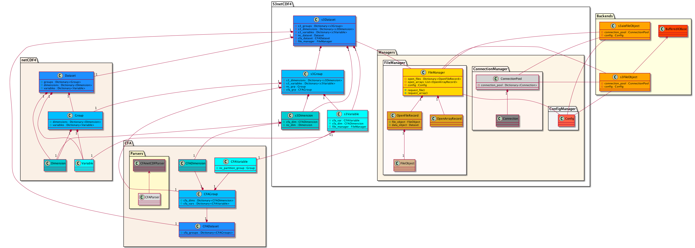
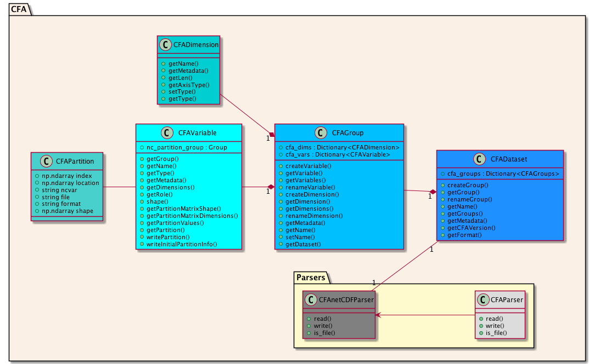
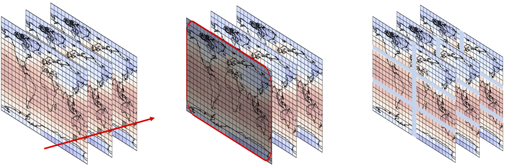
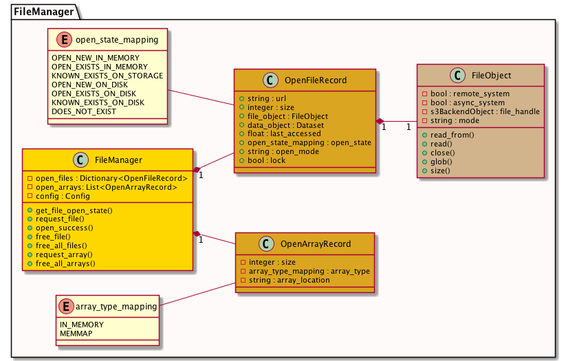
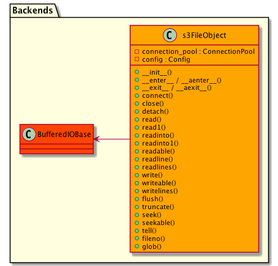

# S3netCDF4 Technical Overview

S3netCDF4 is an extension package to netCDF4-python to enable reading and writing **netCDF** files and **CFA-netcdf** files from / to object stores and public cloud with a S3 HTTP interface, to disk or to OPeNDAP.

A powerful feature of S3netCDF4 is that it allows large netCDF `Datasets` to be decomposed into smaller files, called **sub-array** files.  The aggregation of these files is stored in a **master-array** file.  This contains the full path of each **sub-array** file, its variable name, its shape and its location in the netCDF `Dataset`.  Furthermore, existing netCDF files can be aggregated into one **master-array** file, either without altering the contents of those files, or by also decomposing those files into **sub-array** files.

## Components of S3netCDF4

S3netCDF4 is composed of several subsystems and libraries, as can be seen in Figure 1.
These components are:

* **S3netCDF4** - a direct replacement for the netCDF4-python library [1].
* **CFA** - an object-oriented implementation of the CFA-netCDF conventions [2].
* **Managers** - including:
    * **File Manager** - manages the reading and writing of files in a manner that is agnostic to the type of storage that holds the file.
    * **Connection Manager** - handles connections to any network attached storage devices.
    * **Config Manager** - provides a static configuration to all other parts of S3netCDF4.
* **Backends** - these are "plugable" abstractions to storage devices that provide a common interface for common file-based operations such as *read*, *write*, *seek*, *tell*, etc.


*Figure 1: Overview of the S3netCDF4 components.*

## S3netCDF4

The S3netCDF4 module contains four class definitions that are direct replacements for the classes defined in the netCDF4 module.  The mappings, from the netCDF4 to S3netCDF4 are:

* `Dataset` -> `s3Dataset`
* `Group` -> `s3Group`
* `Variable` -> `s3Variable`
* `Dimension` -> `s3Dimension`

S3netCDF4 has been designed so that integration with user's programs that currently use netCDF4 is a straightforward and minimal effort.  In fact, it is generally a simple one-line change from:

`from netCDF4 import Dataset`

to:

`from S3netCDF4._s3netCDF4 import s3Dataset as Dataset`

The `s3Dataset` class contains all the functionality of the `Dataset` class and handles the creation of the `s3Groups`, `s3Variables` and `s3Dimensions` in the same manner.  Therefore, this is the only strictly necessary import.

Each of the classes contains, via composition, an instance of the corresponding netCDF4 and CFA classes.  `s3Dataset` contains instances of `Dataset` and `CFADataset`; `s3Group` contains `Group` and `CFAGroup`; `s3Variable` contains `Variable` and `CFAVariable` and `s3Dimension` contains `Dimension` and `CFADimension`.

Composition was chosen over (multiple) inheritance due to the way netCDF4 implements some of its functionality.  It was discovered early on in the project that inheriting from the netCDF4 classes would not allow 100% compatibility with the netCDF4 interface.  Instead, functions in the netCDF4 classes that require additional operations are implemented in the s3netCDF4 classes and are passed through to the netCDF4 classes if no additional functionality is needed.

`s3Dataset` supports the creation of `s3Groups`, `s3Variables` and `s3Dimensions`, just as `Dataset` supports the creation of `Groups`, `Variables` and `Dimensions`.
`s3Group` supports the creation of `s3Variables` and `s3Dimensions`, just as `Groups` supports the creation of `Variables` and `Dimensions`.

The `s3Dataset` class provides compatibility with both CFA-netCDF files, which consist of a **master-array** file and a number of **sub-array** files, as well as standard netCDF files.  Additionally, this compatibility extends to standard netCDF files that are stored on S3 storage .

## CFA

A CFA-netCDF dataset consists of two components.  The first is a **master-array** file, which contains the group, dimension and variable definitions of a dataset, as well as any global metadata.  It also contains the values for the dimension variables, which are defined as variables which have the same name as a dimension, and are defined along that dimension.  Field variables are defined in the **master-array** file as having no dimensions and, therefore, have no array elements.  Their actual dimensions are encoded in the variable's metadata and their data is defined in **sub-array** files.  The **master-array** file contains, for each variable, the list of **sub-array** files that contain sub-domains of the variable and how they are located in the **master-array** for that variable.  This is called the **partition matrix**.  There is usually one **master-array** file, but the CFA specification is flexible enough to allow different **master-array** files to reference the same **sub-array** files.

The second component is a number of **sub-array** files.  There is strictly one variable per **sub-array** file, and each **sub-array** file may contain the whole field data for the variable or just a sub-domain of the field data.  In these **sub-array** files, the array dimensions are defined and the field variable is defined with these dimensions.  The dimension variables are also contained in the file, with the values giving the coordinates for the field data.  For a **sub-array** file that contains the whole domain, the dimension variables will contain the coordinate values for the whole domain.  However, for a sub-domain, the dimension variables will only contain the coordinate values for the sub-domain.  Therefore, this makes it possible to locate each **sub-array** file within the **master-array** file.

The CFA module contains four classes (`CFADataset`, `CFAGroup`, `CFAVariable` and `CFADimension`) that define a minimal implementation of a data model for the CFA-netCDF[2] conventions.  This is closely related to the data model for netCDF files, with one noticeable exception in the way that `Groups` and `Datasets` are related.

* In the s3netCDF4 implementation, a `CFADataset` always has one group, the `root` group.  
* Even if no other groups exist in the object, the `root` group does exist.  
* `CFAVariables` and `CFADimensions` can only exist in a `CFAGroup`, they cannot exist as part of a `CFADataset`.  
* `CFAGroups` cannot (currently) contain their own `CFAGroups` in the manner that `Groups` and contain additional `Groups` in the `netCDF4` implementation.

### CFA versions

S3netCDF4 supports two different CFA versions.  These version differ in the way that the CFA partition matrix is encoded within the master-array netCDF file.
* In CFA v0.4, the partition matrix is encoded as a JSON string that is defined as an attribute of the netCDF variable.
* In CFA v0.5, the partition matrix is defined in a group, which itself has dimensions, dimension variables and variables defining the partition matrix.  The group has the same name as the variable it is defining the partition matrix
for, but with a `cfa_` prefix.

Two examples are shown in Figure 2 (for CFA 0.4) and Figure 3 (for CFA 0.5).  These are subsets of files that were created using the same `s3Dataset` generation code, except for the CFA version.

```
variables:
    float tmp ;
        tmp:_FillValue = 2.e+20f ;
        tmp:standard_name = "temperature" ;
        tmp:units = "degrees C" ;
        tmp:long_name = "Surface temperature at 1m" ;
        tmp:cf_role = "cfa_variable" ;
        tmp:cfa_dimensions = "time level latitude longitude" ;
        tmp:cfa_array = "{
    \"pmshape\": [30, 1, 1, 1],
    \"pmdimensions\": [\"time\", \"level\", \"latitude\", \"longitude\"],
    \"Partitions\": [
        {\"subarray\":
            {\"ncvar\": \"tmp\",
            \"file\": \"/Users/dhk63261/Test/s3Dataset_test_CFA4_cfa0.4/
            s3Dataset_test_CFA4_cfa0.4.test_group.tmp.0.0.0.0.nc\",
            \"format\": \"NETCDF4\",
            \"shape\": [12, 1, 73, 144]},
            \"index\": [0, 0, 0, 0],
            \"location\": [[0, 11], [0, 0], [0, 72], [0, 143]]
        },
        {\"subarray\":
            {\"ncvar\": \"tmp\",
            \"file\": \"/Users/dhk63261/Test/s3Dataset_test_CFA4_cfa0.4/
            s3Dataset_test_CFA4_cfa0.4.test_group.tmp.1.0.0.0.nc\",
            \"format\": \"NETCDF4\",
            \"shape\": [12, 1, 73, 144]},
            \"index\": [1, 0, 0, 0],
            \"location\": [[12, 23], [0, 0], [0, 72], [0, 143]]
        }, ...,
    ]
}"
```
*Figure 2: Excerpt from CFA v0.4 format master-array file.*

```
variables:
    float tmp ;
        tmp:_FillValue = 2.e+20f ;
        tmp:standard_name = "temperature" ;
        tmp:units = "degrees C" ;
        tmp:long_name = "Surface temperature at 1m" ;
        tmp:cf_role = "cfa_variable" ;
        tmp:cfa_dimensions = "time level latitude longitude" ;
        tmp:cfa_group = "cfa_tmp" ;

group: cfa_tmp {
    dimensions:
        time = 30 ;
        level = 1 ;
        latitude = 1 ;
        longitude = 1 ;
        ndimensions = 4 ;
        bounds = 2 ;
    variables:
        int pmshape(ndimensions) ;
        string pmdimensions ;
        int index(time, level, latitude, longitude, ndimensions) ;
        int location(time, level, latitude, longitude, ndimensions, bounds) ;
        string ncvar(time, level, latitude, longitude) ;
        string file(time, level, latitude, longitude) ;
        string format(time, level, latitude, longitude) ;
        int shape(time, level, latitude, longitude, ndimensions) ;
} // group cfa_tmp
```
*Figure 3: Excerpt from CFA v0.5 format master-array file.*

The decision to refactor the CFA metadata storage was taken for three reasons:

1. For master-array files that are stored on a disk with random access within the file, for example POSIX compliant disk systems, there is a speed benefit in reading and writing.  When a user takes a slice through a variable, netCDF optimises disk I/O by only reading the part of the file that contains that slice.  With CFA 0.5, this is also applied to the partition matrix.  When a slice is taken into a CFAVariable, only the part of the partition matrix that contains the slice is read.  In CFA 0.4, the whole partition matrix is read into memory on opening the file, which can lead to a "pause" on the initial file open.
2. There is also a memory usage benefit, for the same reasons as the speed benefit.  As only a fraction of the partition matrix is read when a slice is performed, the whole partition matrix does not need to be in memory at once.  Furthermore, the representation of the partition matrix in CFA 0.5 is more efficient than in CFA 0.4 as it uses native types to store, for example, integers, rather than byte strings.
3. Further to point 2, creating a very large `s3Variable` with CFA 0.4 results in an "out of memory" error that can be traced to the underlying netCDF4 C library.  This suggests there is a limit to the length of a netCDF attribute.  CFA 0.5 does not have this problem, with very large `s3Variables` being able to be created.

### Handling metadata

All of the `CFAClasses` contain metadata, which can be written to via methods within each `CFAClass` object.  This metadata is stored in the object and is written out to netCDF attributes when the master-array file is written to.  Metadata in a `CFAVariable` is also written to each sub-array file.


*Figure 4: CFA class hierarchy.*

### CFADataset

`CFADataset` is the parent node in the tree structure of a CFA-netCDF dataset.
Its main purpose is to create, store and provide access to the `CFAGroups` that are contained in the dataset.  It also contains global metadata for the dataset and some file implementation details, such as the netCDF format of the file and the CFA version.

### CFAGroup

`CFAGroups` are the second level nodes in the CFA-netCDF tree structure.  Unlike the `CFADataset`, there may be multiple `CFAGroups` in the dataset. Similarly to the `CFADataset`, the main purpose of `CFAGroup` objects is to create, store and provide access to the `CFAVariable` and `CFADimension` objects that are contained within the group.  The metadata attached to a group is also stored in the `CFAGroup` object, as well as its name.

There will always exist a `CFAGroup` with the name of `root`, even if it is empty.  The empty case will occur when all of the `CFAVariables` and `CFADimensions` are created within one or more `CFAGroups`.  In S3netCDF4 this occurs from a `s3Group` object using the methods `CreateVariable` and `CreateDimension`.  In S3netCDF4, `CFAVariable` and `CFADimension` objects are added to the `root` group if the `CreateVariable` and `CreateDimension` methods are called from a `s3Dimension`.

### CFADimension

`CFADimensions` are at the third level in the CFA-netCDF tree structure.  They are contained only by `CFAGroups`, with the `root` `CFAGroup` containing the dimensions that occur outside of any `Groups` in the netCDF file.

The `CFADimension` class contains a basic set of operations, such as getting and setting the data type, getting the name and the length of a dimension.  It differs from the netCDF `Dimension` class in two ways:

1.  Metadata can be attached to a dimension.  This metadata is written to the dimension variable in the netCDF file for both the **master-array** file and any **sub-array** files containing this dimension.

2.  Axes are typed according to their dimension in space.  The axis types supported are:
    * X axis.  This is also the longitude.
    * Y axis.  This is also the latitude.
    * Z axis.  This can be interpreted as the height above a reference point, a pressure level in the atmosphere, a depth in the ocean, etc.
    * T axis.  This is the time axis.
    * N axis.  This is a "None of the above" axis.  This could be interpreted as an ensemble member, or a flight number, etc.
    * U axis.  Unclassified axis.  This is a default, and an attempt will be made to reclassify the axis.  If the attempt is not successful then the axis will be reclassified as `N`.

 The reason for typing axis is to allow the `CFASplitter` algorithm to apply an optimisation for which it needs to know the axes types.  See the File splitting algorithm section below.
 Axis types can be determined in two ways:

1.  The user specifies the axis type when they call `CreateDimension` from a `CFAGroup` object.
2.  If some axis types are not defined then a function `CFAGroup::_ensure_axis_has_type` is called before the `CFASplitter` algorithm to ensure each axis has a type.  It does this by searching for strings in the dimension name.  For example, if "lat" is the first three characters of the name then it will assign the axis type as `Y`, as it has guessed that it is a "latitude" dimension.

### CFAVariable and the partition matrix

`CFAVariables` are also at the third level in the CFA-netCDF tree structure.  They also are contained only by `CFAGroups`, with the `root` `CFAGroup` containing the variables that occur in the main `Group` in the netCDF file.

The `CFAVariable` class contains the majority of the functionality of the `CFAClasses`.  It contains the partition matrix and has methods that both manipulate and return information from the partition matrix, as well as basic methods for getting the name, numerical type, shape, dimensions the variable is defined along and which group the variable belongs to.

A CFA partition contains the following:

```
file            # The location of the file containing the sub-array.

ncvar           # The name of the variable in the sub-array file.

index           # The index into the partition matrix, an array that has the
                # same length as the shape of the partition matrix.

location        # The location in the master array of the sub-array, an array
                # with the same length as index.

shape           # The shape of the sub-array, and array the same length as index.

format          # The format of the sub-array file, for example NETCDF4.
```
*Figure 5 : structure of a CFA partition.*

Each `CFAVariable` has metadata attached to it, which can be written to and read from.  This metadata is written to both the **master-array** file and the **sub-array** files containing this variable.

`CFAVariables` are created by calling `CFAGroup::CreateVariable`.  There are two options available to the user to determine the shape of the **sub-array**.  Firstly, the **sub-array** shape can be set to what the user wishes, by passing a numpy array containing the shape.  Secondly, the maximum size of the **sub-array** (the maximum number of elements in each **sub-array**) can be passed in as an integer argument.  Using this second option will invoke the `CFASplitter` algorithm which will determine the shape of the **sub-arrays** via an optimisation algorithm.  See [CFASplitter] for more details.

Each `CFAVariable` can be sliced, as in accessing a sub-domain of a variable.  Slicing is done at the **master-array** level in that a slice is taken of a variable that is defined in the **master-array**, without any knowledge of how the **sub-arrays** are organised. It is achieved by overloading the `__getitem__` method for the `CFAVariable` class.  Slicing a `CFAVariable` will undertake a search of the partition matrix to determine which **sub-arrays** are contained within the slice, which sub-domain of each **sub-array** is in the slice and where this sub-domain is located in the **master-array**.  The `__getitem__` returns a list of all of the **sub-arrays** contained in the slice, encoded as named tuples containing:

```
partition : the partition information for this sub-array
source    : the slice to take of the sub-array, i.e. its sub-domain
target    : the location in the destination array
```

*Figure 6 : format of returned tuple from CFAVariable `__getitem__`.*

A major advance from version 1.0 to 2.x of S3netCDF4 is that the partition matrix is stored inside the `CFAVariable` objects as a netCDF `Group`.  This follows the format in Figure 5.

In the partition matrix `Group` there are:

* Dimensions of the partition matrix.  The dimension names will match those of the `CFAVariable`, but their length will be the size of the dimension in the partition matrix.  This size is calculated as the length of the dimension divided by the number of times this dimension has been partitioned.
* A series of variables, with the shape of the partition matrix.  These variables are listed above.

The main advantage of organising the partition matrix as a netCDF `Group` is that, for CFA 0.5, the `Group` inside the `CFAVariable` object can be opened from the corresponding `Group` in the **master-array** file.  NetCDF4 has "lazy loading", in that it will only load the part of the `Dataset` it requires when a slice into a `Variable` is taken.  Providing that the **master-array** file is stored on disk, this reduces memory usage and increases performance because S3netCDF does not have to load and parse the entire partition matrix when the `S3Dataset` is opened.  Instead, when a user takes a slice into a S3netCDF file it will, for a file in read mode, load the part of the partition matrix contained in the slice.  For a file in write mode it will *create* the entries in the partition matrix.  See "Partial writing of field data" below.

### Parsers

The `CFAClasses` impose a data model on the organisation and storage of the partition matrix that is closely related to netCDF.  However, this does not mean that the aggregation of only netCDF files can be represented by CFA.  The CFA conventions are flexible enough to allow the splitting and aggregation of a number of file formats, such as PP-format, GRIB, Zarr and even zipfiles.

However, to support multiple different file types, a parser has to be written to translate the encoding of the CFA partition matrix in the **master-array** file into the data-structures used internally in the `CFAClasses`.  This is done by writing a Parser plug in to the CFA component of S3netCDF4.  A Parser plug in is a class definition that inherits from the `CFA_Parser` class and implements four methods:

* `__init__()` : initialise the parser
* `read(input_object)` : read and parse from an input object, which may be an open file or just a string.
* `write(cfa_dataset, output_object)`: write a CFA class tree to the output object.
* `is_file(input_object)`: test whether an input file, string, etc. has the requisite CFA structures.

Currently there is one Parser defined in S3netCDF4 2.x.  This is the `CFAnetCDFParser` which will read CFA-netCDF **master-array** files, creating the CFA class tree from either a 0.5 or 0.4 format CFA-netCDF file.  It will also write a CFA-netCDF **master-array** file in either 0.5 or 0.4 format from a CFA class tree, by passing in the root of the tree, the `CFADataset`.

### File splitting algorithm

To split the **master-array** into it's constituent **sub-arrays** a method for splitting a large netCDF file into smaller netCDF files is used.  The high-level algorithm is:

1. Split the field variables so that there is one field variable per file.   netCDF allows multiple field variables in a single file, so this is an obvious and easy way of partitioning the file.  Note that this only splits the field variables up, the dimension variables all remain in the **master-array** file.
2. For each field variable file, split along the `time`, `level`, `latitude` or `longitude` dimensions.  Note that, in netCDF files, the order of the dimensions is arbitrary, e.g. the order could be `[time, level, latitide, longitude]` or `[longitude, latitude, level, time]` or even `[latitude, time, longitude, level]`.  S3netCDF4 uses the metadata and name for each dimension variable to determine the order of the dimensions so that it can split them correctly.  Note that any other dimension (`ensemble` or `experiment`) will always have length of 1, i.e. the dimension will be split into a number of fields equal to its length.

The maximum size of an object (a **sub-array** file) can be given as a keyword argument to `s3Dataset.createVariable` or `s3Group.createVariable`: `max_subarray_size=`.  If no `max_subarray_size` keyword is supplied, then it defaults to 50MB. To determine the most optimal number of splits for the `time`, `latitude` or `longitude` dimensions, while still staying under this maximum size constraint, two use cases are considered:

1. The user wishes to read all the timesteps for a single latitude-longitude point of data.
2. The user wishes to read all latitude-longitude points of the data for a single timestep.

For case 1, the optimal solution would be to split the **master-array** into **sub-arrays** that have length 1 for the `longitude` and `latitude` dimension and a length equal to the number of timesteps for the `time` dimension.  For case 2, the optimal solution would be to not split the `longitude` and `latitude` dimensions but split each timestep so that the length of the `time` dimension is 1.  However, both of these cases have the worst case scenario for the other use case.  

Balancing the number of operations needed to perform both of these use cases, while still staying under the `max_subarray_size` leads to an optimisation problem where the following two equalities must be balanced:

1. use case 1 = n<sub>T</sub> / d<sub>T</sub>
2. use case 2 = n<sub>lat</sub> / d<sub>lat</sub> **X** n<sub>lon</sub> / d<sub>lon</sub>

where n<sub>T</sub> is the length of the `time` dimension and d<sub>T</sub> is the number of splits along the `time` dimension.  n<sub>lat</sub> is the length of the `latitude` dimension and d<sub>lat</sub> the number of splits along the `latitude` dimension.  n<sub>lon</sub> is the length of the `longitude` dimension and d<sub>lon</sub> the number of splits along the `longitude` dimension.

The following algorithm is used:

* Calculate the current object size O<sub>s</sub> = n<sub>T</sub> / d<sub>T</ sub> **X** n<sub>lat</sub> / d<sub>lat</sub> **X** n<sub>lon</sub> / d<sub>lon</sub>

* **while** O<sub>s</sub> > `max_subarray_size`, split a dimension:

  * **if** d<sub>lat</sub> **X** d<sub>lon</sub> <= d<sub>T</sub>:

    * **if** d<sub>lat</sub> <= d<sub>lon</sub>:
        split latitude dimension again: d<sub>lat</sub> += 1
    * **else:**
        split longitude dimension again: d<sub>lon</sub> += 1

  * **else:**
    split the time dimension again: d<sub>T</sub> += 1

Using this simple divide and conquer algorithm ensures the `max_subarray_size` constraint is met and the use cases require an equal number of operations.

In version 2.x of S3netCDF4, the user can specify the sub-array shape in the `s3Dataset::createVariable` method.  This circumvents the file-splitting algorithm and uses just the sub-array shape specified by the user.


*Figure 7: Splitting a netCDF variable into approximately equal sized sub-arrays.*<br>
*1. N=n<sub>T</sub> / d<sub>T</sub>*<br>
*2. N=n<sub>lat</sub> / d<sub>lat</sub> * n<sub>lon</sub> / d<sub>lon</sub>*<br>
*3. approximately equal sized sub-arrays.*

### Filenames and file hierarchy of CFA files

As noted above, CFA files actually consist of a single **master-array** file and many **sub-array** files.  These **subarray-files** are referred to by their filepath or URI in the partition matrix.  To easily associate the **sub- array** files with the **master-array** file, a naming convention and file structure is used:

* The [CFA conventions](http://www.met.reading.ac.uk/~david/cfa/0.4/) dictate that the file extension for a CFA-netCDF file should be `.nca`
* A directory is created in the same directory / same root URI as the **master- array** file.  This directory has the same name **master-array** file without the `.nca` extension
* In this directory all of the **sub-array** files are contained.  These subarray files follow the naming convention:

`<master-array-file-name>.<variable-name>.[<location in the partition matrix>].nc`

Example for the **master-array** file `a7tzga.pdl4feb.nca`:

```
├── a7tzga.pdl4feb.nca
├── a7tzga.pdl4feb
│   ├── a7tzga.pdl4feb.field16.0.nc
│   ├── a7tzga.pdl4feb.field16.1.nc
│   ├── a7tzga.pdl4feb.field186.0.nc
│   ├── a7tzga.pdl4feb.field186.1.nc
│   ├── a7tzga.pdl4feb.field1.0.0.nc
│   ├── a7tzga.pdl4feb.field1.0.1.nc
│   ├── a7tzga.pdl4feb.field1.1.0.nc
│   ├── a7tzga.pdl4feb.field1.1.1.nc
```
*Figure 8: Example file structure for a CFA-netCDF dataset.*

On an S3 storage system, the **master-array** directory will form part of the *prefix* for the **sub-array** objects, as directories do not exist, in a literal sense, on S3 storage systems, only prefixes.

Note, however, that the partition-matrix metadata in the master-array file informs S3netCDF4 where the sub-array files are located.  The above file structure defines the default behaviour, but the specification of S3netCDF4 allows sub-array files to be located anywhere, be that on S3, POSIX disk or OpenDAP.

## Managers

S3netCDF4 contains three managers that handle the configuration, file and memory requests and connection requests to S3 storage.

### Configuration manager

The configuration manager is a static class, available to all of the other classes and objects in S3netCDF4, that parses and stores the details of a configuration file that is defined on a per-user basis.  The configuration manager has three main purposes.  The first is to set the resource allocations for memory and number of file handles that S3netCDF4 can use.  The second is to define aliases to remote file systems, such as S3, that allow URL endpoints, credentials and which backend to use to access the URL endpoint.  The third is to provide configuration settings for each backend.

The configuration is stored in a JSON file in the user's home directory at `~/.s3nc.json`.  An example of the file and an explantation is given below:

```
{
    "version": "9",
    "hosts": {
        "s3://tenancy-0": {
            "alias": "tenancy-0",
                "url": "http://tenancy-0.jc.rl.ac.uk",
                "credentials": {
                    "accessKey": "blank",
                    "secretKey": "blank"
                },
                "backend": "s3aioFileObject",
                "api": "S3v4"
        }
    },
    "backends": {
        "s3aioFileObject" : {
            "maximum_part_size": "50MB",
            "maximum_parts": 8,
            "enable_multipart_download": true,
            "enable_multipart_upload": true,
            "connect_timeout": 30.0,
            "read_timeout": 30.0
        },
        "s3FileObject" : {
            "maximum_part_size": "50MB",
            "maximum_parts": 4,
            "enable_multipart_download": false,
            "enable_multipart_upload": false,
            "connect_timeout": 30.0,
            "read_timeout": 30.0
        }
    },
    "cache_location": "/cache_location/.cache",
    "resource_allocation" : {
        "memory": "1GB",
        "filehandles": 20
    }
}
```
*Figure 9: Example configuration file.*

* `version` indicates which version of the configuration file this is.
* `hosts` contains a list of named hosts and their respective configuration details.
  * `s3://tenancy-0` contains the definition of a single host called
  `tenancy-0`.  For each host a number of configuration details need to be supplied:
    * `alias` the alias for the S3 server.  See the Aliases section.
    * `url` the DNS resolvable URL for the S3 server, with optional port number.
    * `credentials` contains two keys:
        * `accessKey` the user's access key for the S3 endpoint.
        * `secretKey` the user's secret key / password for the S3 endpoint.
    * `backend` which backend to use to write the files to the S3 server.  See the Backends section.
    * `api` the api version used to access the S3 endpoint.
* `backends` contains localised configuration information for each of the backends in use, if included in a `host` definition.  See the Backends section for more details on backends.
    * `enable_multipart_download` allow the backend to split files fetched from S3 into multiple parts when downloading.
    * `enable_multipart_upload` allow the backend to split files when uploading. The advantage of splitting the files into parts is that they can be uploaded or downloaded asynchronously, when the backend supports asynchronous transfers.
    * `maximum_part_size` the maximum size for each part of the file can reach before it is uploaded or the size of each part when downloading a file.
    * `maximum_parts` the maximum number of file parts that are held in memory before they are uploaded or the number of file parts that are downloaded at once, for asynchronous backends.
    * `connect_timeout` the number of seconds that a connection attempt will be made for before timing out.
    * `read_timeout` the number of seconds that a read attempt will be made before timing out.
* `cache_location`  S3netCDF4 can read and write very large arrays that are split into **sub-arrays**. To enable very large arrays to be read, S3netCDF4 uses Numpy memory mapped arrays.  `cache_location` contains the location of these memory mapped array files.  See the Cache management section below.
* `resource_allocation` contains localised information about how much resources each instance of S3netCDF4 should use on the host machine.  See the Resource management section below. It contains two keys:
    * `memory` the amount of RAM to dedicate to this instance of S3netCDF4.
    * `file_handles` the number of file handles to dedicate to this instance of S3netCDF4

Sizes in the configuration file can be expressed in units other than bytes by suffixing the size with a magnitude identifier:, kilobytes (`kB`), megabytes (`MB`), gigabytes (`GB`), terabytes (`TB`), exabytes (`EB`), zettabytes (`ZB`) or yottabytes (`YB`).

### Aliases

To enable S3netCDF4 to write to disk, OPeNDAP and S3 object store, aliases are used to identify S3 servers.  They provide an easy to remember (and type) shorthand for the user so that they don't have to use the DNS resolved URL and port number for each S3 object access.  

When creating a `s3Dataset` object, either to read or write, the user supplies a filename.  To indicate that the file should be written to or read from a S3 server, the string must start with `s3://`.  After this must follow the aliased server name, as defined in the config file above.  After this aliased server name a bucket name will follow, for example to read a netCDF file called `test2.nc` from the `test` bucket on the `s3://tenancy-0` aliased server, the full path is `s3://tenancy-0/test/test2.nc`

On creation of the `s3Dataset` object, the S3netCDF4 package parses the filename, determines that the filename starts with `s3://`, reads the next part of the string up to the next `/` (which equates to `tenancy-0` in this case) and searches through the aliases defined in the `~/.s3nc.json` file to find a matching alias.  If one is not found it will return an error message, if it is found then it will establish a connection to that S3 server, via the connection manager, using the `url`, `accessKey` and `secretKey` defined for that server.  It is over this connection that all the data transfers for this `s3Dataset` take place.

### Connection manager

In S3netCDF4, all connections to remote storage are handled via a Connection Manager.  This contains a `ConnectionPool` object which holds the current list of open connections.  When a `s3Dataset` held at an endpoint on remote storage is accessed, S3netCDF asks the `ConnectionPool` whether that endpoint has been accessed previously.  If it has then the `ConnectionPool` already holds a `ConnectionObject`, which is returned to the user.  If it has not, then S3netCDF connects to the endpoint and adds it to the `ConnectionPool`.  Therefore, the next time the endpoint is accessed the existing `ConnectionObject` will be returned.

`ConnectionObjects` contain a reference count of how many times they have been requested.  When S3netCDF has finished with a `ConnectionObject`, it will call the `release` member function.  This will decrease the reference count.  Calling the `add` member function increases the reference count.  When the reference count is zero, the connection that `ConnectionObject` references can be closed.

This `ConnectionPool` is implemented to improve performance by maintaining connections and not repeatably opening and closing connections to the remote storage.  During development it was discovered that establishing a connection to a S3 server can take a not-insignificant length of time, as a percentage of the transfer time of a file.  As S3netCDF potentially transfers many small files from a single S3 server, establishing the connection for each file could have a detrimental effect on performance.  By maintaining and reusing connections, the performance is improved.

### File manager

Rather than accessing files directly, S3netCDF4 instead uses a File Manager to request files, either from an URL endpoint for S3 files, or from a path for files on disk.  The File Manager keeps track of files already opened, and assigns each file a status, which are listed in the open_state_mapping Enum in Figure 10.


*Figure 10: File manager class structure and methods.*

When a file is requested from the FileManager, using the `FileManager:request_file(url)` method, it follows a process:

1. A key is generated from the URL.  This is a sha1 digest of the url.
2. If the key exists in the `file_manager:open_files` Dictionary then, depending on the `open_state` of the file one of three paths can be followed:
    * If the state is `OPEN_EXISTS_ON_DISK` or `OPEN_EXISTS_IN_MEMORY` then the file is currently held in memory, or a file handle exists to the file on disk.  Return the `OpenFileRecord` for this URL key.
    * The `OPEN_KNOWN_ON_DISK` state indicates that the file has been opened before, but has been shuffled out of the list of currently open file handles.  This means that the file needs to be opened again in append mode, if the request mode is write, or read mode if the request mode is read.
    * The `OPEN_KNOWN_IN_MEMORY` state indicates that the file has been opened before, but has been shuffled out of memory.  If the request mode is write, then the file needs to be opened again in append mode.  If the request mode is read then the file needs to be opened again.
3. If the key does not exist in the `file_manager:open_files` Dictionary then it is opened and assigned a state of `OPEN_NEW_IN_MEMORY` or `OPEN_NEW_ON_DISK`, depending on the storage type referenced by the URL.

There is some subtlety involved in opening a file in one mode and then reopening it in another mode, when the file has the state `KNOWN_EXISTS_IN_MEMORY`.  For example opening a file in read mode, then opening it in write or append mode.  In this case, the file is opened in read mode and the netCDF dataset is read into memory, the file is closed and then reopened in write mode, in memory.  The netCDF dataset in memory is then written to the file reopened in write mode.  This allows appending to a file that has been shuffled in and out of memory,

In the `FileManager:request_file(url)` method, files are opened when they are assigned the state `OPEN_NEW_IN_MEMORY`, `OPEN_NEW_ON_DISK`, `OPEN_KNOWN_IN_MEMORY` and `OPEN_KNOWN_ON_DISK`.  When the File Manager opens a file from an URL, a number of tasks are carried out:

1.  The URL is parsed to split the string into the scheme, net location, etc. and the alias for a host is constructed from the scheme and net location.
2.  The configuration file (`~/.s3nc.json`) is searched, via the `ConfigManager` to see if this host alias exists in the config file.
    * If it does then the backend, url and credentials are retrieved from the config file.  These details are used to create a Backend object and establish a connection to the remote file system.  A `FileObject` is created with the Backend object as the `file_handle`.
    * If the alias doesn't exist in the config file, then an attempt is made to open the file on the local file system.  A `FileObject` is created with the on-disk file handle as the `file_handle`.
3.  The `file_handle` is interrogated to determine whether the Backend it points to is a remote system, or is capable of asynchronous transfers and these details are stored in the `FileObject`

Upon completion of the `FileManager:request_file(url)` method, the `FileObject` is returned.  The calling function should then use the `FileObject:file_handle` to open the `s3Dataset` and call `FileManager:open_success(url)` with the same URL.  This indicates that the file opened successfully and transitions the `open_state` of the `OpenFileRecord` referenced by the hashed URL in the `file_manager:open_files` Dictionary.  The transitions are as follows:
```
OPEN_NEW_ON_DISK -> OPEN_EXISTS_ON_DISK
OPEN_NEW_IN_MEMORY -> OPEN_EXISTS_IN_MEMORY
KNOWN_EXISTS_ON_DISK -> OPEN_EXISTS_ON_DISK
KNOWN_EXISTS_ON_STORAGE -> OPEN_EXISTS_IN_MEMORY
```

When a file is requested, the File Manager first checks whether reading or writing to it would violate any of the `resource_allocation` restrictions held in the configuration file.  These are `resource_allocation : memory` and `resource_allocation : filehandles`.  

Files on S3 storage are streamed into memory and so, any file with the `open_state` of `OPEN_NEW_IN_MEMORY` or `KNOWN_EXISTS_ON_STORAGE` will be streamed into memory.  The File Manager will first get the size of the file to be streamed and then determine whether there is enough memory remaining to hold the file, within the `resource_allocation : memory` constraint.  If there isn't, the FileManager will perform a "memory shuffling" procedure, outlined in the Resource management section.

Files on disk are read in the same manner as a standard netCDF file.  This requires a file handle, which may be limited by the operating system or the `ulimit` setting in the shell that S3netCDF4 is running under.  Also, having too many files open at one time may be detrimental to performance and so there is a maximum number of file handles defined in the `resource_allocation : filehandles` entry in the configuration file.  When a file is requested and returns the `open_state` of `OPEN_NEW_ON_DISK` or `KNOWN_EXISTS_ON_DISK`, S3netCDF4 will first check that, by opening the file, the number of file handles will not exceed the `resource_allocation : filehandles` setting.  If it will, then the FileManager will perform a "file shuffling" procedure, outlined in the Resource management section.

### Array management

When a user performs a slice operation on a `s3Variable`, the data from the **sub-arrays** are, ultimately, placed in a Numpy array.  This is known as the destination, or target, array and the File Manager also handles the allocation of memory, in the form of Numpy arrays, to hold this destination array.

When `FileManager::request_array` is called, with a shape and type parameter, it first checks whether the sum of the size of the requested array and the already currently used memory is greater than the `resource_allocation : memory` setting in the configuration file.  If it is less than this setting then an array of the requested shape and type is returned.  

If it is greater than this setting then a Numpy memory mapped array is created with the requested shape and type.  A Numpy memory mapped array is a file on disk that behaves as if it is a Numpy array that is held entirely in memory.  This mapped array file is created in the directory given by the `cache_location` setting in the configuration file.  It's name is a combination of the base filename of the `CFAVariable` and a random integer.  The base filename, as defined in the Filenames and File Hierarchy of CFA Files is:
`<master-array-file-name>.<variable-name>` and so, for example, a mapped array file will have a path of: `cache_location/<master-array-file-name>.<variable-name>_<random-sequence-of-characters>`.

When a mapped array file is created, an `OpenArrayRecord` is created and added to a list within the File Manager.  The `OpenArrayRecord` stores the size, array_type (whether it is `IN_MEMORY` or `MEMMAP`) and the array_location, which is `None` for an `IN_MEMORY` array, and the path of the mapped array file for a `MEMMAP` array.  These mapped array files are cleaned up when the `close` method is called on a `s3Dataset` object.  This calls the `FileManager::free_all_arrays` function which loops over the `OpenArrayRecord` and deletes the mapped array files for `MEMMAP` arrays.

### Resource management

S3netCDF4 has the ability to read and write very large files, much larger than the available, or allocated, memory on a machine.  It also has the ability to read and write many files to and from disk, which means the number of open files may exceed the limit set by the file system, or the settings in `ulimit`.

Files are accessed when a `s3Dataset` is opened, and when a slice operator (`[x,y,z]`) is used on a **CFA-netCDF** file.

To enable very large and very many files to be read from and written to, S3netCDF4 employs a strategy where files are "shuffled" out of memory (to free up memory) or closed (to free up disk handles).  The triggers for this shuffling are configured in the `resource_allocation` section of the `.s3nc.json` config file:

* `resource_allocation: memory`: the amount of memory that S3netCDF4 is allowed to use before a shuffle is triggered.  This applies when reading or writing files from / to remote storage, such as a S3 object store.  S3netCDF4 will stream the entire netCDF file, or an entire **sub-array** file into memory when reading.  When writing, it will create an entire netCDF file or **sub-array** file in memory, writing the file to the remote storage upon closing the file.

* `resource_allocation: disk_handles`: the number of files on disk that S3netCDF4 is allowed to have open at any one time.  This applies when reading or writing files to disk.  S3netCDF4 uses the underlying netCDF4 library to read and write files to disk, but it keeps a track of the number of open files.

S3netCDF4 allows full flexibility over the location of the master-array and sub-array files of CFA-netCDF files.  It allows both to be stored on disk or S3 storage.  For example, the master-array file could be stored on disk for performance reasons, and the sub-array files stored on S3.  Or the first timestep of the sub-array files could also be stored on disk to enable users to quickly perform test analyses*

The file shuffling procedure is carried out by an internal FileManager, which keeps notes about the files that are open at any time, or have been opened in the past and the last time they were accessed.  The user does not see any of this interaction, they merely interact with the `S3Dataset`, `S3Group`, `S3Variable` and `S3Dimension` objects.

1. When a file is initially opened, a note is made of the mode and whether the file is on disk or remote storage.  They are marked as `OPEN_NEW` and then, `OPEN_EXISTS` when they have been opened successfully.
    - For reading from remote storage, the file is streamed into memory and then a netCDF `Dataset` is created from the read in data.
    - For writing to remote storage, the netCDF `Dataset` is created in memory.
    - For reading from disk, the file is opened using the underlying netCDF4 library, and the netCDF `Dataset` is returned.
    - For writing to disk, the file is created using the netCDF4 library and the `Dataset` is returned.
2. If the file is accessed again (e.g. via the slicing operator), then the netCDF `Dataset` is returned.  The FileManager knows these files are already open or present in memory as they are marked as `OPEN_EXISTS`.
3. Steps 1 and 2 continue until either the amount of memory used exceeds `resource_allocation: memory` or the number of open files exceeds `resource_allocation: disk_handles`.
4. If the amount of memory used exceeds `resource_allocation: memory`:
    - The size of the next file is determined (read) or calculated (write).     Files are closed, and the memory they occupy is freed using the Python garbage collector, until there is enough memory free to read in or create the next file.
    - Files that were opened in "write" mode are closed, marked as `KNOWN_EXISTS` and written to either the remote storage (S3) or disk.
    - Files that were open in "read" mode are simply closed and their entry is removed from the FileManager.
    - The priority for closing files is that the last accessed file is closed first.  The FileManager keeps a note when each file was accessed last.
    - If a file is accessed again in "write" mode, and it is marked as `KNOWN_EXISTS` in the FileManager, then it is opened in "append" mode.  In this way, a file can be created, be shuffled in and out of memory, and still be written to so that the end result is the same as if it had been in memory throughout the operation.
5. If the number of open files exceeds `resource_allocation: disk_handles`:
    - The procedure for point 4 is followed, except rather than closing files until there is enough memory available, files are closed until there are free file handles.
  - Files are marked as `KNOWN_EXISTS` as in point 4.

This file shuffling procedure is fundamental to the performance of S3netCDF4, as it minimises the number of times a file has to be streamed from remote storage, or opened from disk.  There are also optimisations in the File Manager, for example, if a file has been written to and then read, it will use the copy in memory for all operations, rather than holding two copies, or streaming to and from remote storage repeatably.

### Partial writing of field data

The **partition** information is only written into the **partition-matrix** when the `s3Dataset` is in "write" mode and the user slices into the part of the **master-array** that is covered by that **partition**.  Consequently, the **sub-array** file is only created when the **partition** is written into the **partition-matrix**.

This leads to the situation that a large part of the **partition-matrix** may have undefined data, and a large number of **sub-array** files may not exist.   This makes s3netCDF4 excellent for sparse data, as the **sub-array** size can be optimised so that the sparse data occupies minimal space.

If, in "read" mode, the user specifies a slice that contains a **sub-array** that is not defined, then the **missing value** (`_FillValue`) is returned for the sub-domain of the **master-array** which the **sub-array** occupies.

### Cache management

If the user requests to read a variable, or a slice of a variable, that is larger than either the host machines physical memory or the `resource_allocation: memory` setting in `~/.s3nc.json`, then S3netCDF4 will use two strategies to enable reading very large arrays:

* a Numpy memory mapped array is used as the destination array, which will contain the data requested by the user.  This is stored in a locally cached file, in the `cache_location` root directory.  These files are deleted in the destructor of S3netCDF4 - i.e. when the program exits, or the S3netCDF4 object goes out of scope.  However, during processing, this directory has the potential to grow quite large so adequate provision should be made on disk for it.
* If the file being read is a **CFA-netCDF** file, referencing **sub-array** files, then the **sub-array** files are streamed into memory (for files on S3 storage) or read from disk.  If the amount of memory used exceeds the `resource_allocation: memory` config setting, or the number of open files exceeds the `resource_allocation: filehandles` config setting, then the last accessed **sub-array** file is closed.  This means it will be removed from memory, or the file handle will be freed, allowing another **sub-array** file to be read.  See the Resource management section for more details.

## Backends

In S3-netCDF4, a backend refers to a set of routines that handles the interface to a storage system.  The interface includes *read* and *write* operations, but also includes operations for gathering file information and file listings.  

S3-netCDF4 has a pluggable backend architecture, and so can interact with new storage systems by writing a new backend plugin.  The backend plugins are extensions of the `io.BufferedIOBase` Python class and implement Python file object methods, such as `tell`, `seek`, `read` and `write`.  This enables interaction with the backend as though they are POSIX disks.  They also implement the `__enter__` and `__exit__` Python methods so that the `with` construct can be used.

The full list of member functions that a Backend class has to implement are given in Figure 11.



*Figure 11: Backend class structure for the s3FileObject backend.*

Although there looks to be many functions to implement when writing a backend for S3netCDF4, there is a lot of shared code between backends, which can be encapsulated via inheritance or composition.

These backends have to be configured on a host by host basis by setting the `host: backend` value in the `~/.s3nc.json` config file.  Currently there are two backends `_s3aioFileObject` and `_s3Fileobject`

* `_s3aioFileObject`
* `_s3FileObject`

### s3aioFileObject
This backend enables asynchronous transfers to a S3 compatible storage system.  It is the fastest backend for S3 and should be used in preference to `_s3FileObject`.  It uses `asyncio` and an asynchronous version of `botocore` (`aiobotocore`).  Using `asyncio` allows operations to be performed concurrently, while the program is waiting for IO operations to complete.  Therefore, S3netCDF4 is less IO bound when using the s3aioFileObject backend, compared to using the s3FileObject backend.

### s3FileObject
This is a simpler, synchronous inferface to S3 storage systems.  It can be used if there is a problem using `_s3aioFileObject`

## References

[1] netCDF4-python: [http://unidata.github.io/netcdf4-python/](http://unidata.github.io/netcdf4-python/)

[2] CFA-netCDF: [http://www.met.reading.ac.uk/~david/cfa/0.4/cfa.html](http://www.met.reading.ac.uk/~david/cfa/0.4/cfa.html)

## List of Figures
Figure 1: Overview of the S3netCDF4 components.

Figure 2: Excerpt from CFA v0.4 format master-array file.

Figure 3: Excerpt from CFA v0.5 format master-array file.

Figure 4: CFA class hierarchy.

Figure 5 : structure of a CFA partition.

Figure 6 : format of returned tuple from `CFAVariable::__getitem__`.

Figure 7: Splitting a netCDF variable into approximately equal sized sub-arrays.

Figure 8: Example file structure for a CFA-netCDF dataset.

Figure 9: Example configuration file.

Figure 10: File Manager class structure and methods.

Figure 11: Backend class structure for the s3FileObject backend.
